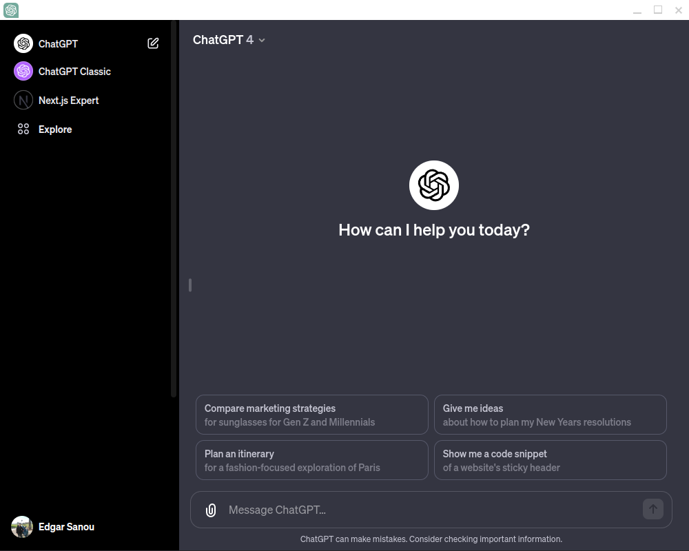

<div align="center">
    
    <h1>ChatGPT-Desktop</h1>
</div>

## Description

<div align="center">
    
</div>

An enhanced unofficial desktop client for ChatGPT, built using Electron. This application allows users to interact with ChatGPT in a dedicated desktop environment, featuring a sleek and simplistic design.

>This application features a top context menu to reload the page or the entire app. Simply hover over the application's icon in the taskbar to see it 😊

## Installation and Setup
```bash
git clone https://github.com/evermine18/ChatGPT-Desktop
cd ChatGPT-Desktop
npm install
```
- In case of just run it:
```bash
npm run start
```
- If you want to build it, simply run:
```bash
npm run dist 
```

## Contributing

Pull requests are welcome. For major changes, please open an issue first
to discuss what you would like to change.

Please make sure to update tests as appropriate.

## License

[MIT](LICENCE.md)